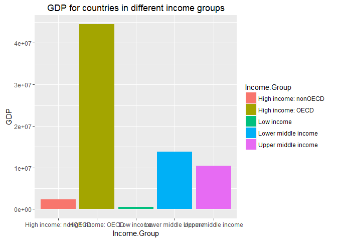

# MSDS6306CaseStudyI
Yanqin Wang  
October 27, 2016  
## This file contains code to download, read, cleanup and merge the Gross Domestic Product data and the Educational data. Further analysis is done on the merged data to answer several questions of interest. 

## libraries required
## install.packages("downloader")  install.packages("plyr")  install.packages("ggplot2")

## part1: introduction to the project.
### We are interested in the Gross Domestic Product data and the Educational data from data.worldbank.org. The GDP data contains country info such as country code and country names, GDP for the countries and ranking of GDP. The Edstats data contains country info, income groups for the countries, info for different surveys including survey time and methods and other related info such as currency unit etc. We have several questions of interest about the data: How many of the IDs match after merging the two datasets by countrycode? What is the 13th country in the resulting data frame after sorting the data in ascending order of GDP? What are the average GDP rankings for the "High income: OECD" and "High income: nonOECD" groups? How does the the GDP for all of the countries distributed in a plot if arranged by income groups? How many countries are Lower middle income but among the 38 nations with highest GDP if cutting the GDP ranking into 5 separate quantile groups? These questions will help us to understand the relationship between GDP and income for the representing countries. 
### To answer the questions, we will download, read, cleanup and merge the GDP data and the Edstats data. And then we will perform analysis on the merged data. Below are code and results for the project followed by a conclusion. 

## part2: download the datasets.

```r
## change directory and download the Gross Domestic Product data and the educational data from https links.
setwd("C:/Users/JT/Desktop/important doc/smu/msds 6306/CaseStudy1")
library(downloader)
download.file("https://d396qusza40orc.cloudfront.net/getdata%2Fdata%2FGDP.csv", destfile="gdp.csv")
download.file("https://d396qusza40orc.cloudfront.net/getdata%2Fdata%2FEDSTATS_Country.csv", destfile="Edstats.csv")
```

## part3: read the datasets in R and check the data.

```r
## read GDP data into R and examine the dataset
gdp <- read.csv("gdp.csv", stringsAsFactors = F, header=T)
str(gdp)
```

```
## 'data.frame':	330 obs. of  10 variables:
##  $ X                          : chr  "" "" "" "" ...
##  $ Gross.domestic.product.2012: chr  "" "" "Ranking" "" ...
##  $ X.1                        : logi  NA NA NA NA NA NA ...
##  $ X.2                        : chr  "" "" "Economy" "" ...
##  $ X.3                        : chr  "" "(millions of" "US dollars)" "" ...
##  $ X.4                        : chr  "" "" "" "" ...
##  $ X.5                        : logi  NA NA NA NA NA NA ...
##  $ X.6                        : logi  NA NA NA NA NA NA ...
##  $ X.7                        : logi  NA NA NA NA NA NA ...
##  $ X.8                        : logi  NA NA NA NA NA NA ...
```

```r
head(gdp)
```

```
##     X Gross.domestic.product.2012 X.1           X.2          X.3 X.4 X.5
## 1                                  NA                                 NA
## 2                                  NA               (millions of      NA
## 3                         Ranking  NA       Economy  US dollars)      NA
## 4                                  NA                                 NA
## 5 USA                           1  NA United States  16,244,600       NA
## 6 CHN                           2  NA         China   8,227,103       NA
##   X.6 X.7 X.8
## 1  NA  NA  NA
## 2  NA  NA  NA
## 3  NA  NA  NA
## 4  NA  NA  NA
## 5  NA  NA  NA
## 6  NA  NA  NA
```

```r
## import educational data into R and check the data.
educ<- read.csv("Edstats.csv", stringsAsFactors = F, header=T)
str(educ)
```

```
## 'data.frame':	234 obs. of  31 variables:
##  $ CountryCode                                      : chr  "ABW" "ADO" "AFG" "AGO" ...
##  $ Long.Name                                        : chr  "Aruba" "Principality of Andorra" "Islamic State of Afghanistan" "People's Republic of Angola" ...
##  $ Income.Group                                     : chr  "High income: nonOECD" "High income: nonOECD" "Low income" "Lower middle income" ...
##  $ Region                                           : chr  "Latin America & Caribbean" "Europe & Central Asia" "South Asia" "Sub-Saharan Africa" ...
##  $ Lending.category                                 : chr  "" "" "IDA" "IDA" ...
##  $ Other.groups                                     : chr  "" "" "HIPC" "" ...
##  $ Currency.Unit                                    : chr  "Aruban florin" "Euro" "Afghan afghani" "Angolan kwanza" ...
##  $ Latest.population.census                         : chr  "2000" "Register based" "1979" "1970" ...
##  $ Latest.household.survey                          : chr  "" "" "MICS, 2003" "MICS, 2001, MIS, 2006/07" ...
##  $ Special.Notes                                    : chr  "" "" "Fiscal year end: March 20; reporting period for national accounts data: FY." "" ...
##  $ National.accounts.base.year                      : chr  "1995" "" "2002/2003" "1997" ...
##  $ National.accounts.reference.year                 : int  NA NA NA NA 1996 NA NA 1996 NA NA ...
##  $ System.of.National.Accounts                      : int  NA NA NA NA 1993 NA 1993 1993 NA NA ...
##  $ SNA.price.valuation                              : chr  "" "" "VAB" "VAP" ...
##  $ Alternative.conversion.factor                    : chr  "" "" "" "1991-96" ...
##  $ PPP.survey.year                                  : int  NA NA NA 2005 2005 NA 2005 2005 NA NA ...
##  $ Balance.of.Payments.Manual.in.use                : chr  "" "" "" "BPM5" ...
##  $ External.debt.Reporting.status                   : chr  "" "" "Actual" "Actual" ...
##  $ System.of.trade                                  : chr  "Special" "General" "General" "Special" ...
##  $ Government.Accounting.concept                    : chr  "" "" "Consolidated" "" ...
##  $ IMF.data.dissemination.standard                  : chr  "" "" "GDDS" "GDDS" ...
##  $ Source.of.most.recent.Income.and.expenditure.data: chr  "" "" "" "IHS, 2000" ...
##  $ Vital.registration.complete                      : chr  "" "Yes" "" "" ...
##  $ Latest.agricultural.census                       : chr  "" "" "" "1964-65" ...
##  $ Latest.industrial.data                           : int  NA NA NA NA 2005 NA 2001 NA NA NA ...
##  $ Latest.trade.data                                : int  2008 2006 2008 1991 2008 2008 2008 2008 NA 2007 ...
##  $ Latest.water.withdrawal.data                     : int  NA NA 2000 2000 2000 2005 2000 2000 NA 1990 ...
##  $ X2.alpha.code                                    : chr  "AW" "AD" "AF" "AO" ...
##  $ WB.2.code                                        : chr  "AW" "AD" "AF" "AO" ...
##  $ Table.Name                                       : chr  "Aruba" "Andorra" "Afghanistan" "Angola" ...
##  $ Short.Name                                       : chr  "Aruba" "Andorra" "Afghanistan" "Angola" ...
```

```r
head(educ)
```

```
##   CountryCode                    Long.Name         Income.Group
## 1         ABW                        Aruba High income: nonOECD
## 2         ADO      Principality of Andorra High income: nonOECD
## 3         AFG Islamic State of Afghanistan           Low income
## 4         AGO  People's Republic of Angola  Lower middle income
## 5         ALB          Republic of Albania  Upper middle income
## 6         ARE         United Arab Emirates High income: nonOECD
##                       Region Lending.category Other.groups  Currency.Unit
## 1  Latin America & Caribbean                                Aruban florin
## 2      Europe & Central Asia                                         Euro
## 3                 South Asia              IDA         HIPC Afghan afghani
## 4         Sub-Saharan Africa              IDA              Angolan kwanza
## 5      Europe & Central Asia             IBRD                Albanian lek
## 6 Middle East & North Africa                                U.A.E. dirham
##   Latest.population.census  Latest.household.survey
## 1                     2000                         
## 2           Register based                         
## 3                     1979               MICS, 2003
## 4                     1970 MICS, 2001, MIS, 2006/07
## 5                     2001               MICS, 2005
## 6                     2005                         
##                                                                 Special.Notes
## 1                                                                            
## 2                                                                            
## 3 Fiscal year end: March 20; reporting period for national accounts data: FY.
## 4                                                                            
## 5                                                                            
## 6                                                                            
##   National.accounts.base.year National.accounts.reference.year
## 1                        1995                               NA
## 2                                                           NA
## 3                   2002/2003                               NA
## 4                        1997                               NA
## 5                                                         1996
## 6                        1995                               NA
##   System.of.National.Accounts SNA.price.valuation
## 1                          NA                    
## 2                          NA                    
## 3                          NA                 VAB
## 4                          NA                 VAP
## 5                        1993                 VAB
## 6                          NA                 VAB
##   Alternative.conversion.factor PPP.survey.year
## 1                                            NA
## 2                                            NA
## 3                                            NA
## 4                       1991-96            2005
## 5                                          2005
## 6                                            NA
##   Balance.of.Payments.Manual.in.use External.debt.Reporting.status
## 1                                                                 
## 2                                                                 
## 3                                                           Actual
## 4                              BPM5                         Actual
## 5                              BPM5                         Actual
## 6                              BPM4                               
##   System.of.trade Government.Accounting.concept
## 1         Special                              
## 2         General                              
## 3         General                  Consolidated
## 4         Special                              
## 5         General                  Consolidated
## 6         General                  Consolidated
##   IMF.data.dissemination.standard
## 1                                
## 2                                
## 3                            GDDS
## 4                            GDDS
## 5                            GDDS
## 6                            GDDS
##   Source.of.most.recent.Income.and.expenditure.data
## 1                                                  
## 2                                                  
## 3                                                  
## 4                                         IHS, 2000
## 5                                        LSMS, 2005
## 6                                                  
##   Vital.registration.complete Latest.agricultural.census
## 1                                                       
## 2                         Yes                           
## 3                                                       
## 4                                                1964-65
## 5                         Yes                       1998
## 6                                                   1998
##   Latest.industrial.data Latest.trade.data Latest.water.withdrawal.data
## 1                     NA              2008                           NA
## 2                     NA              2006                           NA
## 3                     NA              2008                         2000
## 4                     NA              1991                         2000
## 5                   2005              2008                         2000
## 6                     NA              2008                         2005
##   X2.alpha.code WB.2.code           Table.Name           Short.Name
## 1            AW        AW                Aruba                Aruba
## 2            AD        AD              Andorra              Andorra
## 3            AF        AF          Afghanistan          Afghanistan
## 4            AO        AO               Angola               Angola
## 5            AL        AL              Albania              Albania
## 6            AE        AE United Arab Emirates United Arab Emirates
```

## part4: tidy the GDP data.

```r
## remove empty columns and empty rows, rename the variables.
gdp1 <-gdp[5:194, c(1, 2, 4, 5)]
colnames(gdp1) <- c("CountryCode", "Ranking", "Country", "GDP")
tail(gdp1)
```

```
##     CountryCode Ranking               Country   GDP
## 189         FSM     185 Micronesia, Fed. Sts.  326 
## 190         STP     186 São Tomé and Principe  263 
## 191         PLW     187                 Palau  228 
## 192         MHL     188      Marshall Islands  182 
## 193         KIR     189              Kiribati  175 
## 194         TUV     190                Tuvalu   40
```

```r
## convert variable GDP and Ranking to integers and numbers
gdp1$GDP <- as.integer(gsub(",", "", gdp1$GDP))
gdp1$Ranking <- as.numeric(gdp1$Ranking)

## count missing values of Ranking, remove missing values and prepare data for merging.
library(plyr)
count(is.na(gdp1$Ranking))
```

```
##       x freq
## 1 FALSE  190
```

```r
clean.gdp <- gdp1[which(gdp1$Ranking >0), -3]
str(clean.gdp)
```

```
## 'data.frame':	190 obs. of  3 variables:
##  $ CountryCode: chr  "USA" "CHN" "JPN" "DEU" ...
##  $ Ranking    : num  1 2 3 4 5 6 7 8 9 10 ...
##  $ GDP        : int  16244600 8227103 5959718 3428131 2612878 2471784 2252664 2014775 2014670 1841710 ...
```

## part5: tidy the Edstats data.

```r
## remove redundant variables and nondata variables or notes.
educ1 <- educ[which(educ$WB.2.code != ""), -c(2,10,28,31)]

## rename variables.
names(educ1)[27]<- "Country"

## remove "/" and text from variable National.accounts.base.year.
educ1$National.accounts.base.year <- gsub("/", " ", educ1$National.accounts.base.year)
educ1$National.accounts.base.year <- gsub("(Reporting period switch from fiscal year to calendar year from 1996. Pre-1996 data converted to calendar year.)", "", educ1$National.accounts.base.year)

## remove text from variable Latest.population.census.
educ1$Latest.population.census <- gsub("Register based", "", educ1$Latest.population.census)
educ1$Latest.population.census <- gsub("(rolling)", "", educ1$Latest.population.census)

## split variable Latest.household.survey to two separated variables since it contains two different types of info.
## first replace "," or " " or ", " with "_and_" in the variable.
educ1$Latest.household.survey1 <-gsub(", ","_and_", educ1$Latest.household.survey)
educ1$Latest.household.survey2 <-gsub(" ","_and_", educ1$Latest.household.survey1)
educ1$Latest.household.survey3 <-gsub(",","_and_", educ1$Latest.household.survey2)
educ1$Latest.household.survey4 <-gsub("(monthly)","", educ1$Latest.household.survey3)
## then split this varaible into two parts by "_and_', each part is assigned to a new variable.
educ1$Latest.household.survey.type <-gsub("_and_.+$", "", educ1$Latest.household.survey4)
educ1$Latest.household.survey.year <- gsub("^.+_and_", "", educ1$Latest.household.survey4)

## split variable Source.of.most.recent.Income.and.expenditure.data to two separated variables since it contains two different types of info.
## first replace " " or ", " with "_and_" in the variable.
educ1$Source.of.most.recent.Income.and.expenditure.data1 <-gsub(", ","_and_", educ1$Source.of.most.recent.Income.and.expenditure.data)
educ1$Source.of.most.recent.Income.and.expenditure.data2 <-gsub(" ","_and_", educ1$Source.of.most.recent.Income.and.expenditure.data1)
## then split this varaible into two parts by "_and_', each part is assigned to a new variable.
educ1$Source.of.most.recent.Income <- gsub("_and_.+$", "", educ1$Source.of.most.recent.Income.and.expenditure.data2)
educ1$Most.recent.expenditure.data <- gsub("^.+_and_", "", educ1$Source.of.most.recent.Income.and.expenditure.data2)

## remove redundant variables and prepare data for merging.
clean.educ<- educ1[ , -c(8,20, 28:31, 34, 35)]
str(clean.educ)
```

```
## 'data.frame':	208 obs. of  29 variables:
##  $ CountryCode                      : chr  "ABW" "ADO" "AFG" "AGO" ...
##  $ Income.Group                     : chr  "High income: nonOECD" "High income: nonOECD" "Low income" "Lower middle income" ...
##  $ Region                           : chr  "Latin America & Caribbean" "Europe & Central Asia" "South Asia" "Sub-Saharan Africa" ...
##  $ Lending.category                 : chr  "" "" "IDA" "IDA" ...
##  $ Other.groups                     : chr  "" "" "HIPC" "" ...
##  $ Currency.Unit                    : chr  "Aruban florin" "Euro" "Afghan afghani" "Angolan kwanza" ...
##  $ Latest.population.census         : chr  "2000" "" "1979" "1970" ...
##  $ National.accounts.base.year      : chr  "1995" "" "2002 2003" "1997" ...
##  $ National.accounts.reference.year : int  NA NA NA NA 1996 NA NA 1996 NA NA ...
##  $ System.of.National.Accounts      : int  NA NA NA NA 1993 NA 1993 1993 NA NA ...
##  $ SNA.price.valuation              : chr  "" "" "VAB" "VAP" ...
##  $ Alternative.conversion.factor    : chr  "" "" "" "1991-96" ...
##  $ PPP.survey.year                  : int  NA NA NA 2005 2005 NA 2005 2005 NA NA ...
##  $ Balance.of.Payments.Manual.in.use: chr  "" "" "" "BPM5" ...
##  $ External.debt.Reporting.status   : chr  "" "" "Actual" "Actual" ...
##  $ System.of.trade                  : chr  "Special" "General" "General" "Special" ...
##  $ Government.Accounting.concept    : chr  "" "" "Consolidated" "" ...
##  $ IMF.data.dissemination.standard  : chr  "" "" "GDDS" "GDDS" ...
##  $ Vital.registration.complete      : chr  "" "Yes" "" "" ...
##  $ Latest.agricultural.census       : chr  "" "" "" "1964-65" ...
##  $ Latest.industrial.data           : int  NA NA NA NA 2005 NA 2001 NA NA NA ...
##  $ Latest.trade.data                : int  2008 2006 2008 1991 2008 2008 2008 2008 NA 2007 ...
##  $ Latest.water.withdrawal.data     : int  NA NA 2000 2000 2000 2005 2000 2000 NA 1990 ...
##  $ WB.2.code                        : chr  "AW" "AD" "AF" "AO" ...
##  $ Country                          : chr  "Aruba" "Andorra" "Afghanistan" "Angola" ...
##  $ Latest.household.survey.type     : chr  "" "" "MICS" "MICS" ...
##  $ Latest.household.survey.year     : chr  "" "" "2003" "2006/07" ...
##  $ Source.of.most.recent.Income     : chr  "" "" "" "IHS" ...
##  $ Most.recent.expenditure.data     : chr  "" "" "" "2000" ...
```
### This data contains a big number of variables. Among them many variables have lots of NAs. Removing NAs from all varaibles at the same time will shrink the data in a very misleading way. NAs from a specific variable can be removed when that variable is used in further analysis. 

## part6: merge datasets after tidying.

```r
## merge dataset clean.gdp and dataset clean.educ by variable CountryCode.
cleandata <- merge(clean.gdp, clean.educ, by="CountryCode", all=T)
```

## part7: perform analysis to answer questions of interest.
### Q1: after merging the data based on the country shortcode, how many of the IDs match?

```r
## subset the merged data for further analysis, this dataset contains only info for country, GDP, ranking of GDP and income groups. 
## remove missing values from Ranking and missing values from Income group after counting their missing values.
sub1 <- cleandata[, c(1,2,3,4,27)]
count(is.na(sub1$Ranking))
```

```
##       x freq
## 1 FALSE  190
## 2  TRUE   20
```

```r
count(sub1$Income.Group == "")
```

```
##       x freq
## 1 FALSE  208
## 2    NA    2
```

```r
sub2 <- subset(sub1, sub1$Ranking>0 & sub1$Income.Group != "")
str(sub2)
```

```
## 'data.frame':	188 obs. of  5 variables:
##  $ CountryCode : chr  "ABW" "AFG" "AGO" "ALB" ...
##  $ Ranking     : num  161 105 60 125 32 26 133 172 12 27 ...
##  $ GDP         : int  2584 20497 114147 12648 348595 475502 9951 1134 1532408 394708 ...
##  $ Income.Group: chr  "High income: nonOECD" "Low income" "Lower middle income" "Upper middle income" ...
##  $ Country     : chr  "Aruba" "Afghanistan" "Angola" "Albania" ...
```

```r
## count countrycode to get numbers of matching IDs after removing all missing values from sub1.
length(sub2$CountryCode)
```

```
## [1] 188
```
### Answer: total 188 matching IDs after merging. 

### Q2: Sort the data frame in ascending order by GDP (so United States is last). What is the 13th country in the resulting data frame?

```r
## Sort the data frame in ascending order by GDP.
sorted <- arrange(sub2, GDP)
sorted[13, 5]
```

```
## [1] "St. Kitts and Nevis"
```
### Answer: the 13th country in the resulting data frame is "St. Kitts and Nevis".

### Q3: What are the average GDP rankings for the "High income: OECD" and "High income: nonOECD" groups?

```r
## create a subset only containing data for income group "High income: OECD" and get the average GDP rankings for this income group.
sub3 <- sub2[which(sub2$Income.Group=="High income: OECD"), ]
mean(sub3$Ranking)
```

```
## [1] 32.96667
```

```r
## create a subset only containing data for income group "High income: nonOECD" and get the average GDP rankings for this income group.
sub4 <- sub2[which(sub2$Income.Group=="High income: nonOECD"), ]
mean(sub4$Ranking)
```

```
## [1] 91.91304
```
### Answer: the average GDP rankings for the "High income: OECD" is 33 and the average GDP rankings for the "High income: nonOECD" is 92.

### Q4: Plot the GDP for all of the countries. Use ggplot2 to color your plot by Income Group.

```r
## Plot the GDP for all of the countries and color the plot by Income Group.
library(ggplot2)
plot <- ggplot(data=sub2, aes(x=Income.Group, y=GDP, fill=Income.Group)) +
  geom_bar(stat="identity")
plot+labs(title="GDP for countries in different income groups")
```

<!-- -->


### Answer: this plot shows GDP for countries in 5 different income groups. Each bar represents GDP for a group. Countries in High income: OECD group has the highest GDP among all groups. On the other hand, countries in High income: nonOECD group has the second to the lowest GDP although they are in high income group. 

### Q5: Cut the GDP ranking into 5 separate quantile groups. Make a table versus Income.Group. How many countries are Lower middle income but among the 38 nations with highest GDP?

```r
##Cut the GDP ranking into 5 separate quantile groups. create a dataset containing this variable ranking group using sub2. 
Ranking.Group<- cut(sub2$Ranking,
                    breaks = c(0.99, 38.99, 76.99, 114.99, 152.99, 190.99),
                    labels = c("low", "medium low", "medium", "medium high", "high"))
summary(Ranking.Group)
```

```
##         low  medium low      medium medium high        high 
##          38          38          38          36          38
```

```r
sub5 <- cbind.data.frame(sub2, Ranking.Group)
sub5$Ranking.Group <- as.character(sub5$Ranking.Group)
str(sub5)
```

```
## 'data.frame':	188 obs. of  6 variables:
##  $ CountryCode  : chr  "ABW" "AFG" "AGO" "ALB" ...
##  $ Ranking      : num  161 105 60 125 32 26 133 172 12 27 ...
##  $ GDP          : int  2584 20497 114147 12648 348595 475502 9951 1134 1532408 394708 ...
##  $ Income.Group : chr  "High income: nonOECD" "Low income" "Lower middle income" "Upper middle income" ...
##  $ Country      : chr  "Aruba" "Afghanistan" "Angola" "Albania" ...
##  $ Ranking.Group: chr  "high" "medium" "medium low" "medium high" ...
```

```r
## Make a table of ranking.group versus Income.Group.
c = count(sub5, c('Ranking.Group', 'Income.Group'))
c
```

```
##    Ranking.Group         Income.Group freq
## 1           high High income: nonOECD    2
## 2           high           Low income   11
## 3           high  Lower middle income   16
## 4           high  Upper middle income    9
## 5            low High income: nonOECD    4
## 6            low    High income: OECD   18
## 7            low  Lower middle income    5
## 8            low  Upper middle income   11
## 9         medium High income: nonOECD    8
## 10        medium    High income: OECD    1
## 11        medium           Low income    9
## 12        medium  Lower middle income   12
## 13        medium  Upper middle income    8
## 14   medium high High income: nonOECD    4
## 15   medium high    High income: OECD    1
## 16   medium high           Low income   16
## 17   medium high  Lower middle income    8
## 18   medium high  Upper middle income    7
## 19    medium low High income: nonOECD    5
## 20    medium low    High income: OECD   10
## 21    medium low           Low income    1
## 22    medium low  Lower middle income   13
## 23    medium low  Upper middle income    9
```
### Answer: based on the table, there are 16 countries that have Lower middle income but among the 38 nations with highest GDP.

## Part8: draw a conclusion.
### This case study provides data to look at the relationship between GDP and income for 188 countries all around the world. Five GDP ranking groups were compared with five different income groups for these countries, respectively. We found that high GDP is not always associated with high income. The same relationship was observed between low GDP and low income. In another word, there is no linear correlation between GDP and income for a particualr country. Many factors are contributed to that. Population is a huge one.
